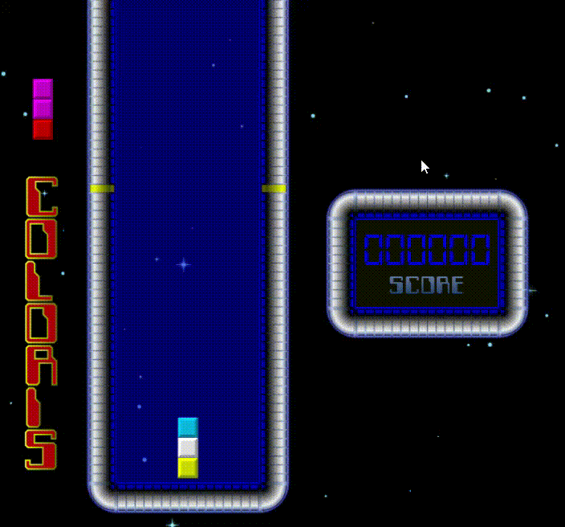

# Coloris

## Inspiration

A 2D JavaFX application inspired by *Coloris*, a single-player puzzle video game, that was originally released in 1990, for *Comodore Amiga* family of personal computers.

## Setup

This project contains an embedded [Gradle](https://docs.gradle.org/current/userguide/userguide.html) to build the project. 
From the command line, run `gradlew run` (Windows) or `./gradlew run` (macOS and Linux) to download the Gradle wrapper and dependencies, compile the code, and launch the game.

## Gameplay

The gameplay bears resemblance to *Tetris* and *Columns*: blocks, consisting of three randomly colored squares, fall from the top of the screen to a well.
**Orientation** of the blocks **cannot be changed**, but the squares within them can be **shifted circularly** (⬆️ navigation key).
The falling block **can be moved horizontally** in both directions (⬅️ and ➡️ navigation keys), and its falling **can be sped up** (⬇️ navigation key).
Once the block hits bottom of the well, or another block, the following rule is applied: if **three or more** squares of the **same** color are **adjacent**, they **disappear**, blocks **above** them **fall down**, which **may trigger a chain reaction**. If five or more squares disappear, bottom row disappears, regardless of colors of the squares within it.

## Fonts and audio

Font used for the game logo, *game over* label and *score* label can be found [here](https://www.dafont.com/computerfont.font).
*Score counter* font can be found [here](https://www.dafont.com/digital-7.font).
Audio was extracted from [this YouTube video](https://www.youtube.com/watch?v=BLX5HAIlRLs&feature=youtu.be&t=9m15s).

## Note to the reader of this README

If you have any question, suggestion or collaboration offer, please feel free to [contact me](mailto:danijel.askov@gmail.com).
**If you find this repository useful, please consider starring it!**